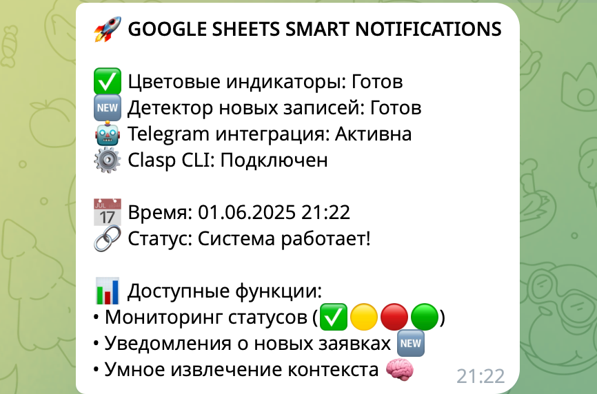
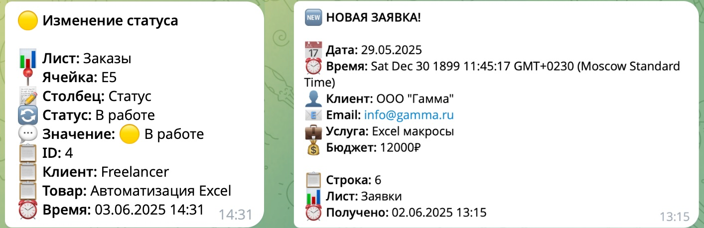
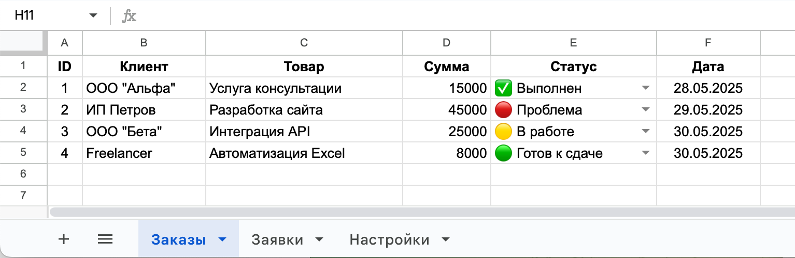

# Google Sheets Smart Notifications

**Автоматические уведомления в Telegram при изменениях в Google Таблицах**

Система реального времени для мониторинга Google Таблиц с мгновенными уведомлениями в Telegram. Отслеживает изменения статусов, новые записи и обеспечивает гибкую конфигурацию через интерфейс таблицы.



---

## Основные возможности

- **Детектор изменения статусов** - отслеживание эмодзи (✅🟡🔴🟢) и текстовых статусов
- **Детектор новых записей** - уведомления при добавлении новых строк
- **Настраиваемая конфигурация** - управление через Google Таблицу
- **Rate limiting** - защита от спама уведомлений
- **Модульная архитектура** - 7 независимых модулей



---

## Технический стек

- **Google Apps Script** - серверная логика и триггеры
- **Google Sheets API** - работа с таблицами
- **Telegram Bot API** - отправка уведомлений
- **Google Clasp CLI** - локальная разработка и деплой

## Структура проекта

```
src/
├── main.js              # Основной координатор и триггеры
├── colorDetector.js     # Детектор изменения статусов
├── recordDetector.js    # Детектор новых записей
├── settings.js          # Управление настройками
├── telegram.js          # Интеграция с Telegram API
├── utils.js             # Вспомогательные функции
├── config.js            # Конфигурация (токены, настройки)
└── appsscript.json      # Манифест Google Apps Script
```

## Установка

### 1. Клонирование репозитория
```bash
git clone [repository-url]
cd google-sheets-smart-notifications
```

### 2. Установка Google Clasp
```bash
npm install -g @google/clasp
clasp login
```

### 3. Создание Apps Script проекта
```bash
clasp create --type standalone --title "Smart Notifications"
```

### 4. Настройка конфигурации
```bash
cp src/config.js.example src/config.js
```

Отредактируйте `src/config.js`:
```javascript
const CONFIG = {
  TELEGRAM: {
    BOT_TOKEN: "your_bot_token_here",
    CHAT_ID: "your_chat_id_here",
    API_URL: "https://api.telegram.org/bot"
  }
};
```

### 5. Деплой
```bash
clasp push
```

## Настройка Google Таблицы

### Демо-таблица

Для изучения структуры используйте готовую демо-таблицу:
**[Google Sheets Smart Notifications Demo](https://docs.google.com/spreadsheets/d/112TSbwZz04kPHxEDvZBPC_blQ6xVDwZhOcimF32-ClA/edit)**

**Для тестирования:** Создайте копию таблицы (`File → Make a copy`), так как демо-таблица доступна только для просмотра.



Создайте Google Таблицу с тремя листами:

### Лист "Заказы"
Основная структура с мониторингом статусов:
```
| A (ID) | B (Клиент) | C (Товар) | D (Сумма) | E (Статус) | F (Дата) |
```

**Важно:** Столбец E "Статус" должен иметь **Data Validation** с выпадающим списком:
- ✅ Выполнен
- 🔴 Проблема  
- 🟡 В работе
- 🟢 Готов к сдаче

### Лист "Заявки"
Структура для детектора новых записей:
```
| A (Дата) | B (Время) | C (Клиент) | D (Email) | E (Услуга) | F (Бюджет) |
```

### Лист "Настройки"
Конфигурация системы с **Data Validation** для TRUE/FALSE параметров:
```
| Параметр | Значение |
|----------|----------|
| ENABLE_COLOR_NOTIFICATIONS | TRUE |
| ENABLE_NEW_RECORDS | TRUE |
| MAX_NOTIFICATIONS_PER_MINUTE | 10 |
| NOTIFICATION_DELAY_MS | 1000 |
| ENABLE_DEBUG_LOGGING | FALSE |
| SYSTEM_SHEETS_EXCLUDE | Настройки |
```

Таблица содержит примеры данных, корректные Data Validation правила и демонстрирует правильную организацию листов.

## Настройка Telegram бота

1. Создайте бота через @BotFather
2. Получите токен бота
3. Узнайте chat_id:
   - Отправьте сообщение боту
   - Откройте `https://api.telegram.org/bot<TOKEN>/getUpdates`
   - Скопируйте значение `chat.id`

## Запуск

1. Обновите `DEMO_SPREADSHEET_ID` в `main.js` на ID вашей таблицы
2. В Apps Script консоли запустите:
   ```javascript
   createSpreadsheetTrigger(); // Создает installable триггер
   testSystemSetup();          // Проверяет работоспособность
   ```

## Тестирование

Доступные функции для тестирования:
- `testSystemSetup()` - общая проверка системы
- `testNewRecordDetector()` - тест детектора новых записей
- `testAdvancedSettings()` - проверка настроек
- `testTelegramConnection()` - проверка Telegram подключения

## Поддерживаемые статусы

Система распознает статусы по эмодзи и ключевым словам:

**Эмодзи статусы:** ✅ 🟡 🔴 🟢  
**Текстовые статусы:** "выполнен", "в работе", "проблема", "готов"

Полный список ключевых слов см. в `colorDetector.js`

## Разработка

### Локальная разработка
```bash
# Синхронизация изменений
clasp push

# Просмотр логов
clasp logs
```

### Отладка
Включите debug-режим в настройках таблицы:
```
ENABLE_DEBUG_LOGGING = TRUE
```

## Лицензия

MIT License